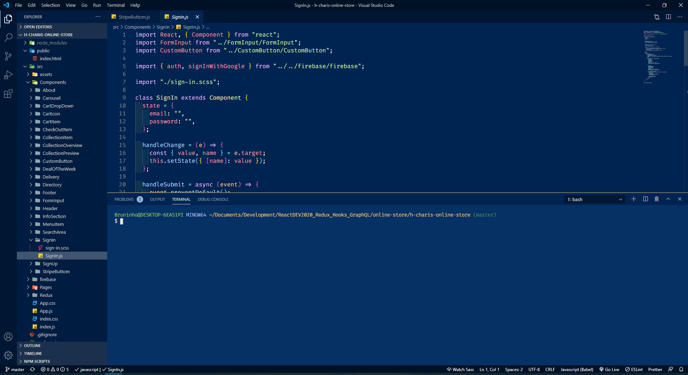

# VsCode-Setup

## Lesson Objectives

1. Overview
2. Take a look at my set up
3. Add some of my VS code extensions
4. Take a look at some VS Code short cuts
5. Fork, Clone, and Contribute

## Overview

My favorite code editor is [ VS Code](https://code.visualstudio.com/) mainly because it is highly customizable and some of the awesome features you encounter here are created and maintained by developers just like you!

VS Code has a market place which makes it easy for you to add features to your editor that can help you to be more productive when developing applications.

**Here are my some tips, shortcuts, and set-up that you can feel free to incorporate in your environment**

## 🎨 Theme:

My color theme is an edited version of the VS Code default dark theme `Tomorrow Night Blue`



Let's change the theme to a VS Code default theme.

1. Click on the settings icon, located in the left bottom. ⚙️
2. Color Theme
3. OR use the shortcut CTR+K CTR+T
4. Select a theme from the dropdown list.

Here is a collection of vs code theme you can incorporate to your VS CODE from the market place.

[ 50 VS Code Themes for 2020](https://dev.to/thegeoffstevens/50-vs-code-themes-for-2020-45cc)

#### 🤓 Nerd Section & Fun Themes:

[ win95 ](https://marketplace.visualstudio.com/items?itemName=asilva.win95)

[ Slack Theme ](https://marketplace.visualstudio.com/items?itemName=felipe-mendes.slack-theme)

[ HotDogStand ](https://marketplace.visualstudio.com/items?itemName=somekittens.hot-dog-stand)

[ HotDogStand ](https://marketplace.visualstudio.com/items?itemName=somekittens.hot-dog-stand)

## 📁 Left Icons:

File Icons is a quick a way to visualize directory, organize your files, and enhance your Visual Studio look

You can go directly to the market place for this one.

Here are some suggestions:

[ VSCode Great Icons](https://marketplace.visualstudio.com/items?itemName=emmanuelbeziat.vscode-great-icons)

[ Material Icon Theme](https://marketplace.visualstudio.com/items?itemName=emmanuelbeziat.vscode-great-icons)

[ VSCode Icons](https://marketplace.visualstudio.com/items?itemName=vscode-icons-team.vscode-icons)

**Minimalist icons**

[ Chalice Icon Theme](https://marketplace.visualstudio.com/items?itemName=artlaman.chalice-icon-theme)

[ Minimalist Product Icon Theme](https://marketplace.visualstudio.com/items?itemName=ElAnandKumar.el-vsc-product-icon-theme)

## ✏️ Font:

The font I use is called `Fira Code, Cascadia Code`, and it supports ligatures, which is just away to style symbols (it is just for visual purpose).

[ The best monospace fonts for coding in 2020 ](https://www.creativebloq.com/features/the-best-monospace-fonts-for-coding)

1. You have to install the font in your VS Code first
2. Click on the settings icon, located in the left bottom. ⚙️
3. Settings
4. OR use the shortcut CTR+,
5. Under Commonly Used>>Text Editor Select Font
6. You can just add the name of the font and default fonts
7. You can also use Json format to insert the name of the Font.

**Important: You must have the font installed and have the exact font name and defaults, Read the docs**

If you want to use my settings

```
 "editor.fontSize": 16,
  "editor.lineHeight": 22,
  "editor.letterSpacing": 0.5,
  "editor.fontWeight": "400",
  "editor.formatOnSave": true,
  "editor.fontFamily": "Fira Code, Cascadia Code",
  "editor.fontLigatures": true,
  "editor.cursorWidth": 5,
  "editor.cursorStyle": "line",
  "markdown.preview.lineHeight": 2.2,
  "workbench.colorTheme": "Tomorrow Night Blue",
  "liveServer.settings.donotShowInfoMsg": true
}

```

## ✏️ Extension:

#### Peacock

[ Peacock](https://marketplace.visualstudio.com/items?itemName=johnpapa.vscode-peacock)

## Advance Settings:

You don't have to do this part, if you don't want to. This is just extra stuff given by VS code that I hardly use.

1. Sidebar on left

2. <span style="color:tomato">Disable:<span>
   1. Open Editor
   2. Minimap
